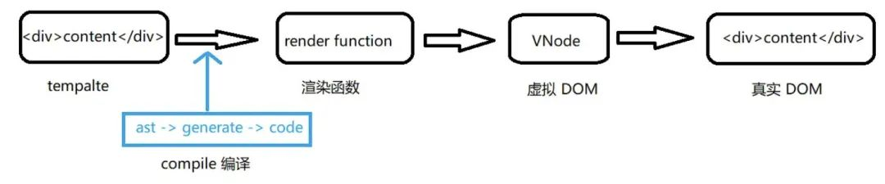

### 13.对虚拟DOM的理解
现在框架都引入了虚拟DOM对真实DOM进行抽象，即VDOM和VNode

1.虚拟dom是一个dom对象，本身是JavaScript对象，通过不同的属性描述一个视图结构
2.引入vdom的好处：将真实的dom结构转为抽象的vNode，有效减少操作dom的次数，提高性能，方便跨平台
 - 同一vNode渲染成不同的平台上的对应的内容，比如渲染到浏览器上是dom元素，渲染在native(ios,android)上是对应的控件，可选实现SSR,渲染到WenGL中等等
 - Vue3中允许开发者基于Vnode实现自定义渲染器Renderer,以便针对不同平台进行渲染
 - 直接操作dom是有限制的，比如diff,clone等，一个真实的元素上有很多内容，如果直接对其进行diff操作，会去额外diff一些没有必要的内容
 - 操作dom是比较昂贵的操作，频繁的dom操作会引起页面的重绘和回流，但是通过抽象Vnode进行中间处理，可以有效减少操作dom的次数，减少重绘和回流
  
3. vdom如何生成？
   vue中我们常会为组件编写模板-template,这个模板会被编译器-compiler编译为渲染函数，在接下来的挂载（mount）过程中调用render函数，返回的对象就是虚拟dom,再经过patch进一步转为真实dom

   
4. 挂载过程结束后，vue程序进入更新流程，如果某些响应式数据发生变化，将会引起组件重新render,此时就会生成新的vdom，和上一次的渲染结果diff就能得到变化的地方，从而转化为最小量的dom操作，高效更新视图

vnode定义：

https://github1s.com/vuejs/core/blob/HEAD/packages/runtime-core/src/vnode.ts#L127-L128

观察渲染函数：21-vdom/test-render-v3.html

创建vnode：

createElementBlock:
https://github1s.com/vuejs/core/blob/HEAD/packages/runtime-core/src/vnode.ts#L291-L292

createVnode:
https://github1s.com/vuejs/core/blob/HEAD/packages/runtime-core/src/vnode.ts#L486-L487

首次调用时刻：
https://github1s.com/vuejs/core/blob/HEAD/packages/runtime-core/src/apiCreateApp.ts#L283-L284

mount:

https://github1s.com/vuejs/core/blob/HEAD/packages/runtime-core/src/renderer.ts#L1171-L1172

调试mount过程：mountComponent

21-vdom/test-render-v3.html