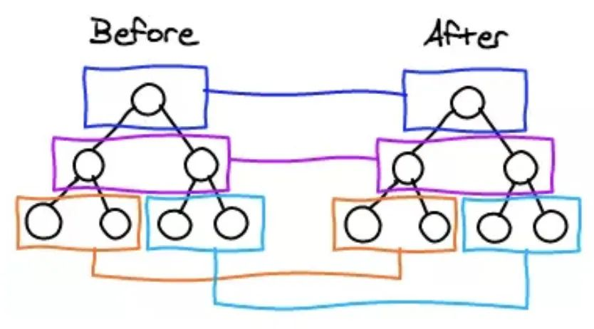

#### 15.diff算法

   

1.diff算法是干什么的？
vue中diff算法称为patching算法，它由snabbdom修改而来，虚拟dom想要转化为真实dom就需要patch方法转化

2.他的必要性
vue1中视图中每个依赖均有更新函数对应，可以做到精准更新，因此不需要虚拟dom和patch算法支持，但是粒度过细导致vue1无法承载较大的应用
vue2中为了降低watcher粒度，每个组件只有一个watcher与之对应，因此需要引入patching算法才能精准找到发生变化的地方并高效更新

3.他何时执行
组件内响应式数据变更触发实例执行其更新函数时，更新函数会再次执行render函数获取最新的虚拟dom，然后执行patch函数，并传入新旧两次虚拟dom，通过对比2者找到变化的地方，最后将其转化为对应的dom操作

4.具体执行方式
patch过程时一个递归过程，遵循深度优先，同层比较的策略，以vue3的patch为例
- 判断新旧2个节点是不同类节点，则删除重建
- 如果新旧2个节点都是文本节点，则更新文本内容
- 如果新旧2个节点都是元素节点，则递归更新子元素，同时更新元素属性
   - 更新子节点又分为以下几种情况：
   - 新子节点是文本，旧子节点是数组，则清空，并设置文本
   - 新子节点是文本，旧子节点是文本，则直接更新文本
   - 新子节点是数组，旧子节点是文本，则清空文本，并创建新子节点数组中元素
   - 新子节点是数组，旧子节点是数组，则递归调用updateChildren

5.vue3中diff的优化
编译器优化patchFlags,block

源码解析：
patch关键代码

https://github1s.com/vuejs/core/blob/HEAD/packages/runtime-core/src/renderer.ts#L354-L355

调试 test-v3.html

#### key的作用
1. key的作用是为了更高效的更新虚拟DOM
2. vue在patch过程中判断2个节点是否是相同节点sameVnode，key是一个必要条件，渲染一组列表时，key往往时唯一标识，如果不定义key的话，vue只能认为2个节点是不同节点，导致频繁更新，使得patch低效，影响性能
3. 实际使用中渲染一组列表时key必须设置，而且必须是唯一标识，应该避免使用数组索引作为key,这可能导致一些隐藏的bug,vue中使用相同标签过渡切换时，也会使用key属性，其目的也是为了让vue区分他们，否则vue只会替换其内部属性而不会触发过渡效果
4. vue判断2个节点是否相同主要判断2个key和元素类型，因此如果不设置key,它的值就是undefined,则肯认为这是2个相同的节点，只能去做更新操作，这造成大量的dom更新操作，

